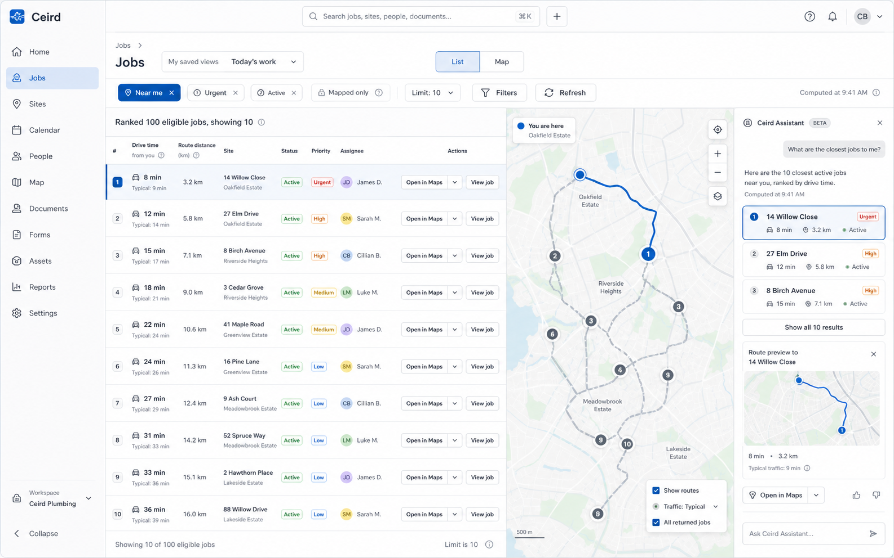
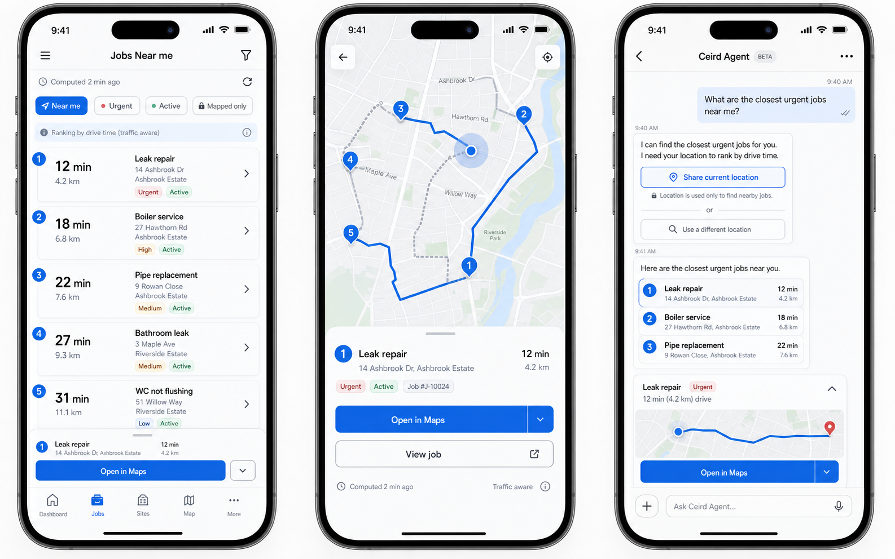
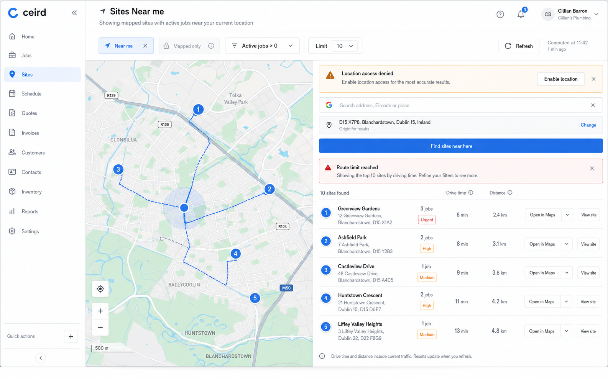
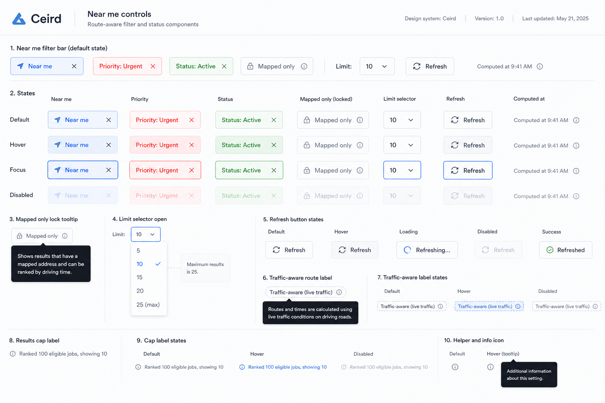
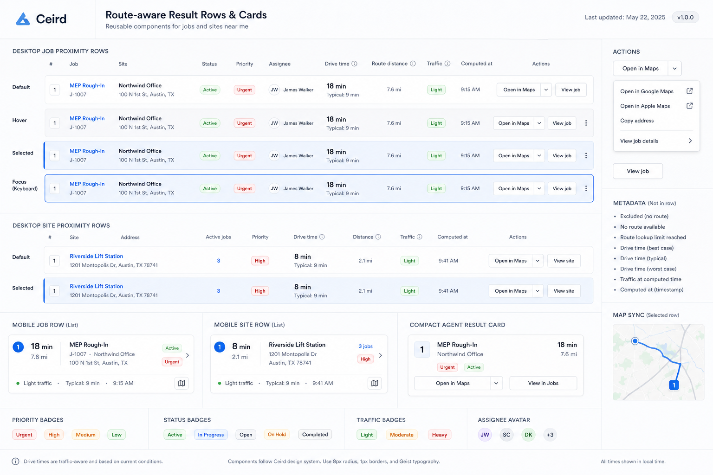
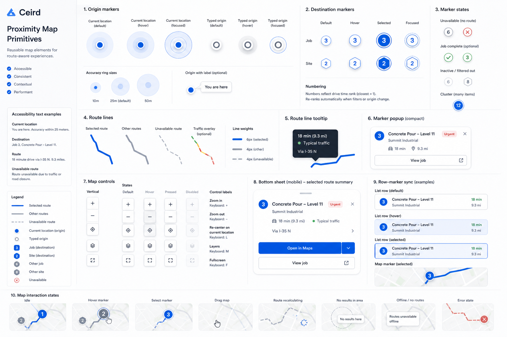
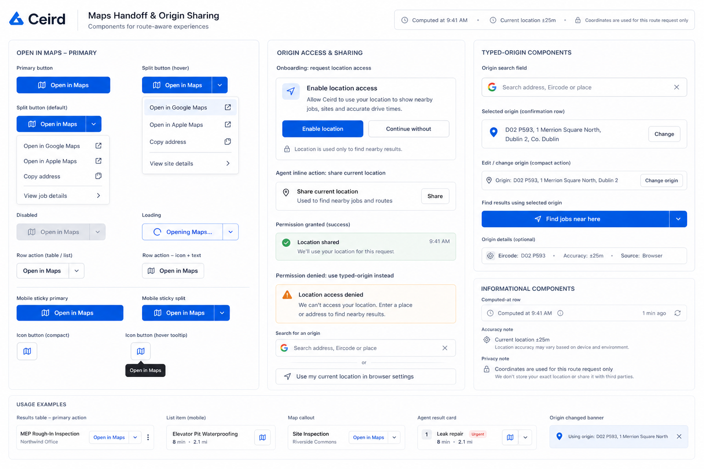
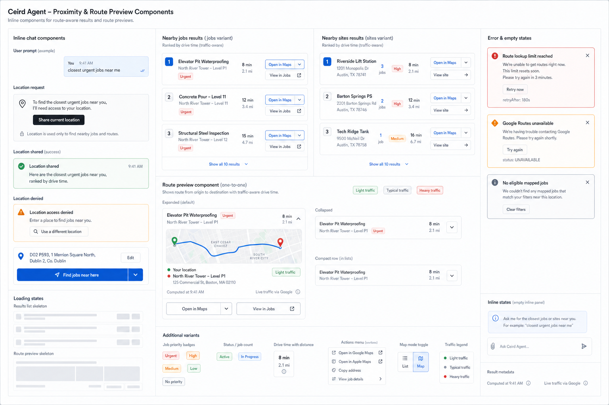
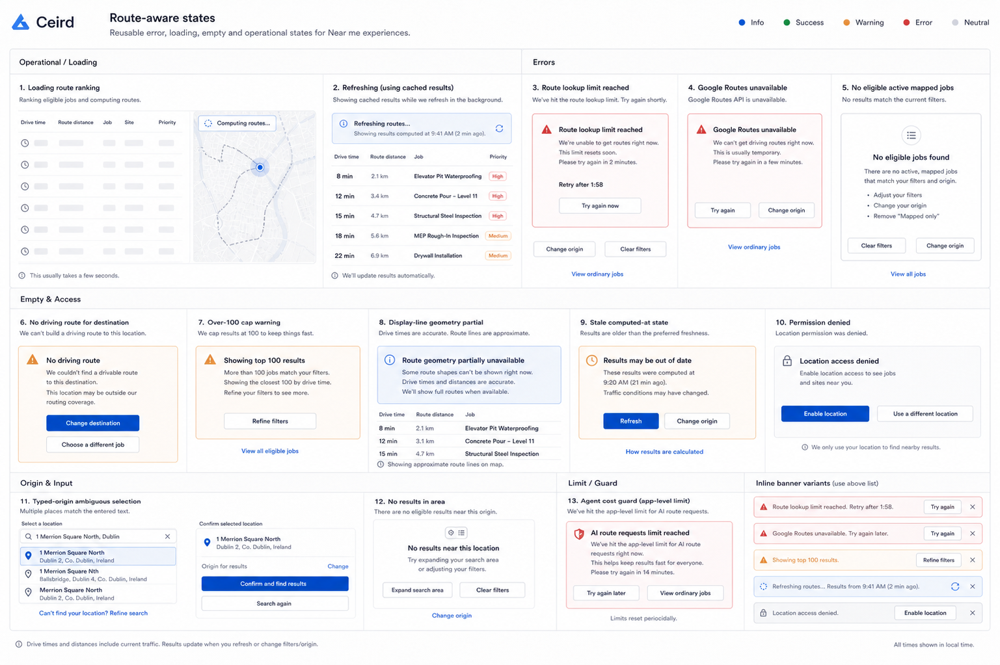

# Route-Aware Job And Site Proximity UI Lock-In

## Purpose

This document preserves the approved UI direction for route-aware Jobs, Sites,
and Agent proximity. It is product/design context, not an implementation plan.

Use it with
[Route-Aware Job And Site Proximity Design](./2026-06-03-route-aware-job-proximity.md)
when planning implementation.

## Product Design Context

- Register: product UI.
- Scene: a tradesperson or operations coordinator is choosing the next job or
  site under daylight, often between field tasks, with enough pressure that the
  interface must be fast, exact, and trustworthy.
- Color strategy: restrained Ceird product palette. Tinted neutrals carry the
  surface; work blue marks selection and action; semantic colors appear only for
  operational status, priority, warnings, and errors.
- Design anchors: Linear-level density and trust, shadcn-style primitives,
  operational map surfaces, embedded AI that behaves like infrastructure.
- Avoid: decorative construction imagery, generic SaaS dashboards, purple AI
  glow, glassmorphism, hero-style layouts, card-heavy marketing composition, and
  route UI that feels like turn-by-turn navigation.

## Combined Directions

These images lock the overall topology and responsive direction. They are
reference artifacts, not final copy, final spacing, or accessibility behavior.

### Jobs Near Me, Laptop

Carry forward:

- Continuous Jobs dashboard with Near me as a selected filter state.
- Dense route-ranked rows beside an operational map.
- Drive time as the primary route value; route distance as supporting context.
- Locked mapped-only chip while Near me is active.
- Route display lines for returned rows, with selected row and route synced.
- `Open in Maps` split action and ordinary job detail navigation in-row.

### Mobile Near Me

Carry forward:

- Mobile list rows lead with drive time and keep route distance visible.
- Mobile map mode uses a bottom sheet for the selected row, not a detached page.
- Agent flow can request current location inline when the global preference or
  browser permission is missing.
- Route preview in chat is compact, display-only, and includes map handoff.

### Sites Near Me, Laptop

Carry forward:

- Sites Near me can use a map-first layout with a dense results rail.
- Site rows include active job count and highest active priority.
- Typed-origin fallback is an inline dashboard state, not a separate wizard.
- Route-limit and provider errors should not hide ordinary Jobs or Sites data.

## Component Boards

### Near Me Filter Controls

Lock-in:

- Near me appears as an explicit selected chip/control.
- Mapped only is visibly locked while Near me is active.
- Limit selector is compact and defaults to 10.
- Refresh sits near computed-at time.
- Traffic-aware labels need a tooltip explaining driving route context.
- Cap labels are calm metadata, not warnings unless the result is materially
  constrained.

### Route Result Rows And Cards

Lock-in:

- Rows and compact cards share the same route summary vocabulary.
- Selected state uses work-blue emphasis through border/fill/focus, not a
  colored side stripe.
- Job and site rows stay domain-specific while reusing route summary primitives.
- Route time is the quickest scan target. Priority/status remain filters and
  context, not the primary sort expression.
- Agent cards use the same row vocabulary in a tighter format.

### Proximity Map Primitives

Lock-in:

- Current-location origin marker and typed-origin marker are visually distinct.
- Destination markers are numbered to match ranked rows.
- Default route lines are muted; selected route line uses work-blue.
- Hovering or focusing a row, marker, or route line highlights the linked
  elements together.
- Unavailable route geometry can omit the line while keeping the ranked row and
  destination pin when route ranking succeeded.
- The map remains a planning surface, not turn-by-turn navigation.

### Maps Handoff And Origin Sharing

Lock-in:

- Primary action is `Open in Maps`.
- Attached menu exposes explicit Google Maps and Apple Maps options.
- Origin-sharing components must explain that current coordinates are used for
  the route request only.
- Account/onboarding establishes a location access preference, not a saved
  coordinate.
- If location is unavailable, the UI moves to typed-origin selection.

### Agent Inline Components

Lock-in:

- Agent proximity results render structured inline components, not raw JSON.
- The agent asks for current location through a clear inline action when needed.
- List-style agent results use compact ranked cards and omit route geometry.
- Specific job/site proximity questions render a route preview with mini-map,
  route line, drive time, distance, computed-at, and maps handoff.
- Agent errors should stop retry loops and explain the limit or provider issue.

### Route Operational States

Lock-in:

- Route ranking loading uses skeleton rows/map affordances, not a blank spinner.
- Cost guard, provider unavailable, no-route, no eligible mapped result, and cap
  states need typed, actionable copy.
- Route failures should preserve ordinary Jobs/Sites data where possible.
- Primary recovery actions are `Refresh`, `Change origin`, `Clear filters`, and
  `View ordinary jobs` depending on the state.
- Error states use semantic warning/error treatment sparingly and stay embedded
  in the continuous dashboard.

## Interaction Spec

- Near me is a filter mode. It respects existing filters, adds a locked
  mapped-only constraint, requests a proximity origin, and orders usable results
  by driving time.
- List view may request route summaries without route geometry. Map view and
  route preview request route display lines.
- Switching from list to map may make a second request with
  `includeRouteLines=true`; the route cache should reuse fresh matrix work.
- Result rows, map markers, and route lines are linked selection surfaces.
  Hover, focus, and selection should sync across all three.
- `Open in Maps` is available from rows, cards, selected map items, and route
  previews. The attached menu provides explicit provider choices.
- Mobile preserves the same mental model: filter chips, route-ranked rows, map
  mode, bottom sheet selected result, and agent inline components.
- Location access is global preference plus per-device browser permission. The
  UI always asks the browser for fresh current position when needed.
- Typed-origin fallback is a two-step selected/confirmed origin flow.

## Implementation Handoff Notes

- Treat these images as direction references. Do not copy generated text or
  generated map details blindly.
- Build source-owned Ceird components using existing shadcn-style primitives,
  Hugeicons/Lucide conventions already present in the codebase, and the shared
  hotkey layer.
- Keep map-library work behind the Ceird map primitive. If Google Maps is
  required for route display lines, run the documented product-wide map spike
  before implementing Near me UI.
- Keep this as product/design context. A later implementation plan should link
  to this document and break the work into package, API, agent, app UI, map, and
  verification phases.
