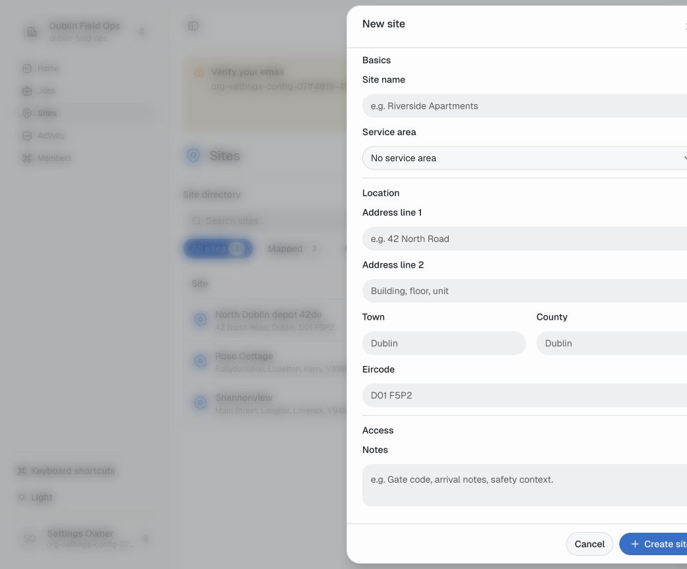
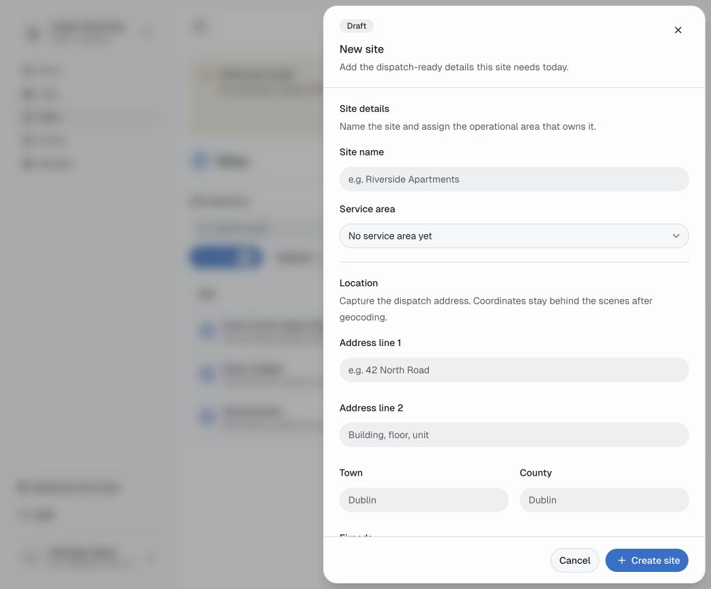

# Sites Create Drawer Worklog

## Goal

Ship a production-ready New site drawer aligned to the confirmed impeccable shape:
supported fields only, clean grouped drawer layout, accessible validation and route
close behavior preserved, reusable site-specific form sections kept simple, with
proof from focused/full tests, type/lint/format checks, and in-app browser
verification.

## Shape To Preserve

- Product register, restrained light UI.
- Scene: an office admin quickly adding a dispatch-ready site from a desktop
  workspace, with the same flow still usable on-site from mobile.
- Drawer, not modal. No tabs.
- Supported fields only: site name, service area, address fields, access notes.
- Omit unsupported fields for this pass: status, site lead, contact, labels,
  separate site notes, address autocomplete, and fake map preview.
- Group into clear sections: Basics, Location, Access.
- Keep actions pinned at the bottom.
- Preserve Vaul close animation before route cleanup.
- Prefer site-specific composition first, avoid prop-drilling blobs.

## Compaction Note

If this thread compacts, reload the impeccable context and continue from this
shape. The user explicitly asked to reference
`/Users/cillianbarron/.codex/worktrees/c9d7/ceird/.agents/skills/impeccable/SKILL.md`
and the `shape` direction when resuming.

## Checklist

- [x] Persist outcome-based goal and shape brief.
- [x] Reshape create drawer layout to right-side production drawer.
- [x] Group supported form fields into Basics, Location, Access sections.
- [x] Update tests for supported-only field inventory and drawer behavior.
- [x] Verify with focused Sites tests.
- [x] Verify with broader app tests/type/lint/format.
- [x] Inspect in the in-app browser and capture proof.
- [x] Record final validation evidence here.

## Validation Evidence

### 2026-05-16 Impeccable Critique Pass

- Cut visible duplicate copy from the New site drawer: no Draft chip, no
  explanatory header paragraph, no section descriptions, no coordinates copy,
  and no unsupported future fields.
- Tightened section labels to Basics, Location, and Access. The Access field
  label is now simply Notes, avoiding the visible "Access / Access notes"
  repetition.
- Tightened drawer spacing so the supported field set fits in the right-side
  drawer at the inspected laptop-height viewport without an internal initial
  scroll.
- Latest focused proof:
  `pnpm --filter app test -- src/features/sites/sites-create-sheet.test.tsx`
  passed: 7 tests.
- Latest mechanical proof:
  - `pnpm format` passed.
  - `pnpm lint` passed: 0 warnings, 0 errors.
  - `pnpm check-types` passed: 9 successful packages.
- Latest Impeccable detector proof:
  `npx impeccable detect --json apps/app/src/features/sites/sites-create-sheet.tsx apps/app/src/features/sites/site-create-form.tsx`
  returned `[]`.
- Latest in-app Browser proof on
  `https://critique-sites-direction.app.ceird.localhost:1355/sites/new`:
  - settled drawer rect: `x=611`, `y=0`, `width=576`, `height=863`;
  - scroll container metrics: `scrollHeight=721`, `clientHeight=721`;
  - present: New site, Basics, Location, Access, Site name, Service area,
    Address line 1, Address line 2, Town, County, Eircode, Notes;
  - absent: Draft, Coordinates, "No service area yet", and the old
    Address-heading duplication.

- `pnpm --filter app test -- src/features/sites/sites-create-sheet.test.tsx`
  passed: 7 tests. This includes supported-only field inventory, validation,
  required-field `aria-describedby` wiring, create payload submission, handled
  create errors, waiting close controls, and a close-lifecycle test proving
  navigation waits until the drawer close animation completes.
- `pnpm --filter app test -- src/features/auth/password-reset-page.test.tsx src/features/sites/sites-create-sheet.test.tsx`
  passed after settling an existing password reset test that left successful
  reset navigation unresolved for later tests.
- `pnpm format` passed: all matched files use the correct format.
- `pnpm lint` passed: 0 warnings, 0 errors.
- `pnpm check-types` passed: 9 successful packages.
- `pnpm --filter app test` passed: 93 files, 622 tests.
- `pnpm test` passed: 9 package test tasks plus 27 script tests.
- In-app Browser proof on
  `https://critique-sites-direction.app.ceird.localhost:1355/sites/new`:
  - light theme active, route drawer mounted with `role="dialog"` and
    `data-state="open"`;
  - settled drawer rect: `x=465`, `y=0`, `width=576`, `height=863`,
    `transform=none`;
  - required content present: Draft, New site, Site details, Location, Notes,
    Site name, Service area, Address line 1, Address line 2, Town, County,
    Eircode, Access notes;
  - unsupported fields absent: Status, Site lead, Email, Phone, Labels, Site
    notes, Map preview;
  - close then reopen via the New site route was verified in the browser before
    capturing the settled proof.

